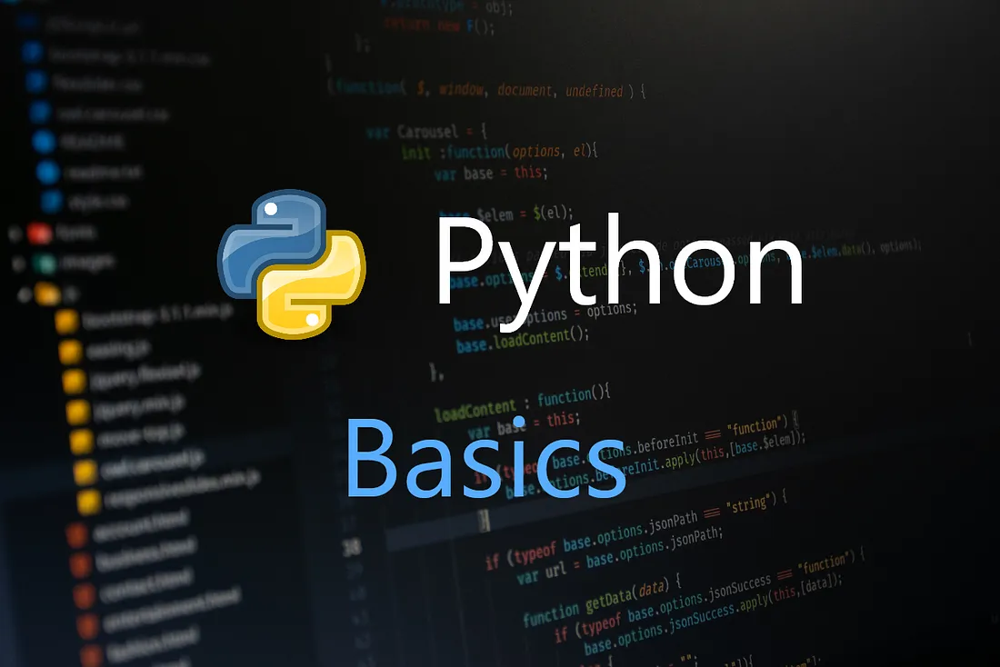
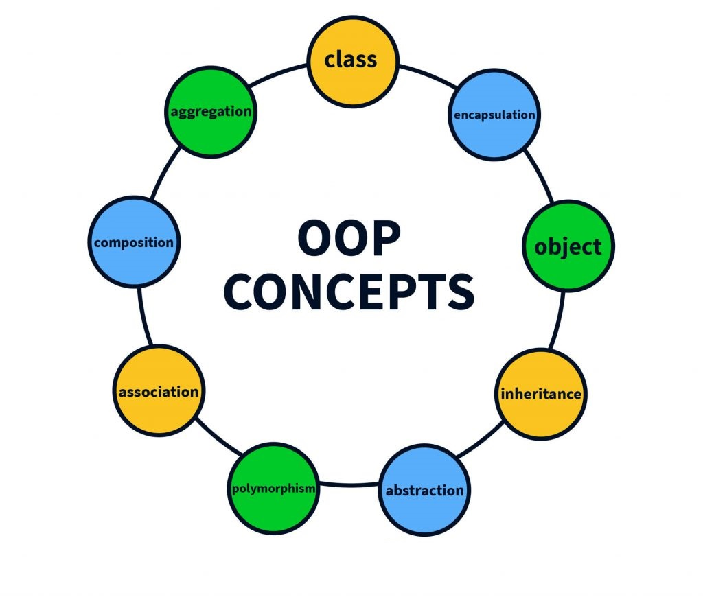
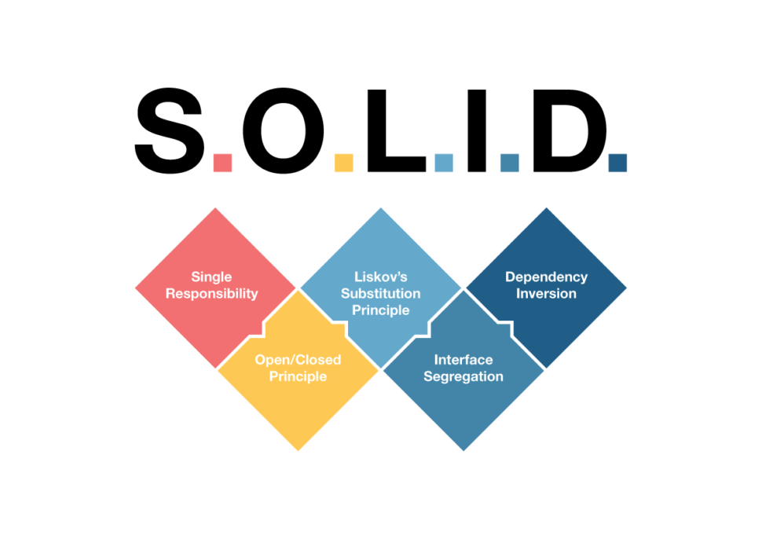

# 🐍 POO | SOLID | Python 🐍

Este repositorio contiene una colección de ejercicios y proyectos de Python organizados en diferentes categorías. Cada sección aborda un aspecto específico de la Programación Orientada a Objetos y SOLID mediante el uso del lenguaje Python, desde los fundamentos hasta principios avanzados de diseño de software.

# Contenidos del Repositorio
## Python Fundamentals


Esta sección cubre los fundamentos del lenguaje Python, ideal para principiantes y para repasar conceptos básicos.

- **Operadores y Estructuras de Control**: Uso de operadores y estructuras de control como bucles y condicionales.
- **Funciones y Alcance**: Definición y uso de funciones, así como el alcance de las variables.
- **Estructuras de Datos**: Listas, diccionarios, conjuntos, y más.
- **Manejo de Excepciones**: Cómo manejar errores y excepciones en Python.
- **Manejo de Ficheros**: Lectura y escritura de archivos.
- **JSON y XML**: Manipulación de datos en formatos JSON y XML.
- **Pruebas Unitarias**: Creación de pruebas unitarias para asegurar la calidad del código.

## POO (Programación Orientada a Objetos)

En esta sección, se exploran los conceptos fundamentales de la programación orientada a objetos en Python.

- **Introducción a POO**: Conceptos básicos y ejemplos iniciales.
- **Abstracción, Encapsulamiento, Herencia y Polimorfismo**: Ejemplos y ejercicios que ilustran estos principios de POO.
- **Herencia vs Composición**: Comparación y uso adecuado de herencia y composición en diseño de software.

[Gráfico de los conceptos básicos OOP](https://xmind.app/embed/2SwRjm/)

## POO (Programación Orientada a Objetos)

En esta sección, se exploran los conceptos fundamentales de la programación orientada a objetos en Python.

- **Introducción a POO**: Conceptos básicos y ejemplos iniciales.
- **Abstracción, Encapsulamiento, Herencia y Polimorfismo**: Ejemplos y ejercicios que ilustran estos principios de POO.
- **Herencia vs Composición**: Comparación y uso adecuado de herencia y composición en diseño de software.

[Gráfico Programación orientada a Objetos](https://www.xmind.app/embed/2SwRjm/)

## Principios SOLID

Esta sección contiene ejemplos y ejercicios que ilustran los principios SOLID de diseño de software.

- **Responsabilidad Única (SRP)**: Ejemplos de cómo aplicar el principio de responsabilidad única.
- **Abierto/Cerrado (OCP)**: Ejercicios que muestran cómo extender el comportamiento del código sin modificarlo.
- **Sustitución de Liskov (LSP)**: Principios para asegurar que las subclases puedan reemplazar a las clases base sin problemas.
- **Segregación de Interfaces (ISP)**: Ejemplos de cómo dividir interfaces grandes en más pequeñas y específicas.
- **Inversión de Dependencias (DIP)**: Ejercicios que muestran cómo depender de abstracciones en lugar de concreciones.

## Ejercicios Completos
Esta carpeta contiene una variedad de ejercicios prácticos que cubren diferentes aspectos de Python, incluido la resolucoión de ejercicios típicos de pruebas técnicas.

## Cómo Empezar

1. **Clonar el repositorio**:
    ```bash
    git clone https://github.com/PabloSanchez87/Python_OPP_SOLID_Fundamentals.git
    ```

2. **Explorar los archivos**:
    Revisa y ejecuta los archivos Python en cada sección para aprender y practicar.

## Contribuciones

¡Las contribuciones son bienvenidas! Siéntete libre de abrir un issue o enviar un pull request con mejoras, correcciones o nuevos ejercicios.

## Contacto

Para cualquier consulta o sugerencia, puedes contactarme en [sancheztorrespablo@gmail.com](mailto:sancheztorrespablo@gmail.com).

---

¡Espero que este repositorio te sea útil para mejorar tus habilidades en Python!
